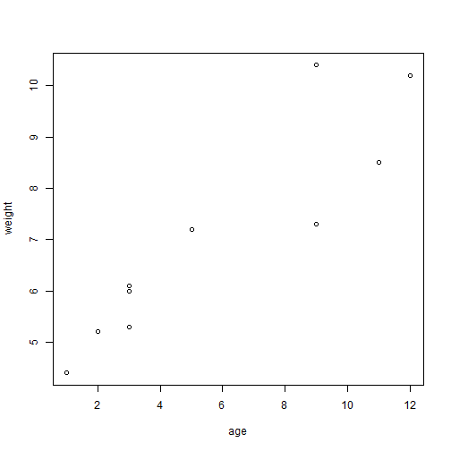
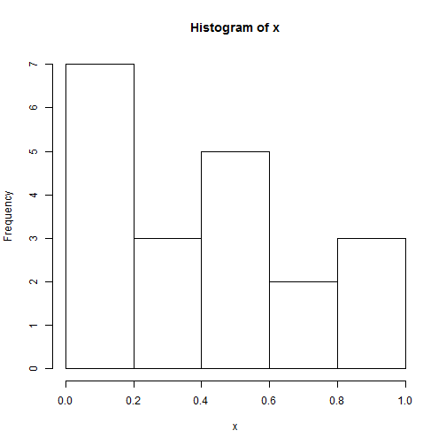
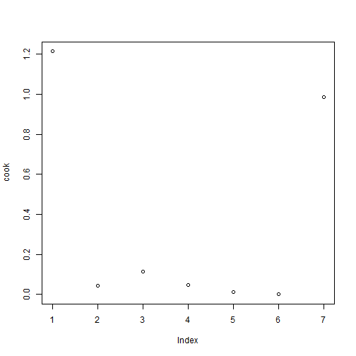
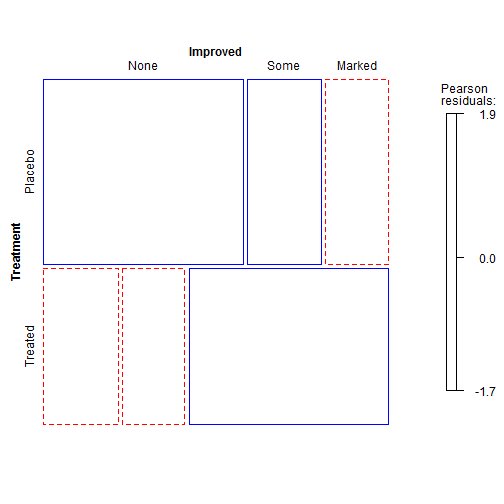
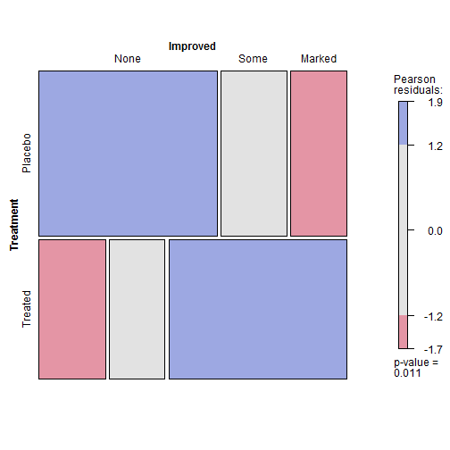

## 新手上路
--------
### 一个简单的虚构示例

```r
x <- rnorm(5) #赋值操作，创建一个名为x的向量对象，包含5个来自标准正态分布的随机偏差。
x #输出向量x
```

```
## [1] -0.4169  0.3903  0.8053  0.7064  0.9489
```

```r
#婴儿年龄与体重
age <- c(1,3,5,2,11,9,3,9,12,3) #函数c()以向量形式赋值
mean(age) #mean()函数求平均年龄
```

```
## [1] 5.8
```

```r
weight <- c(4.4,5.3,7.2,5.2,8.5,7.3,6.0,10.4,10.2,6.1)
mean(weight) #mean()函数求平均体重
```

```
## [1] 7.06
```

```r
sd(weight) #sd()函数求标准差
```

```
## [1] 2.077
```

```r
cor(age,weight) #cor()求线性相关度
```

```
## [1] 0.9076
```

```r
plot(age,weight) #画年龄与体重的散点图
```

 

```r
#q() #退出程序
```
> 小提示：*要想了解R能够作出何种图形，在命令行中运行demo(graphics)即可。其他的演示还有demo(Hershey)、demo(persp)、demo(image)。要看到完整的演示列表，不加参数直接运行demo()即可。*

```r
#demo(graphics)
```

### 获取帮助

```r
#help.start() #打开帮助文档首页
#help("mean") #查看函数mean的帮助，引号可以省略
#?mean        #同上
#help.search("mean") #以mean为关键词搜索本地帮助文档
#??mean              #同上
#example("mean") #函数mean的使用示例
#RSiteSearch("mean") #以mean为关键词搜索在线文档和邮件列表存档
apropos("mean", mode="function") #列出名称中含有mean的所有可用函数
```

```
##  [1] ".colMeans"     ".rowMeans"     "colMeans"      "kmeans"       
##  [5] "mean"          "mean.Date"     "mean.default"  "mean.difftime"
##  [9] "mean.POSIXct"  "mean.POSIXlt"  "rowMeans"      "weighted.mean"
```

```r
#data() #列出当前已加载包中所含有的所有可用示例数据集
#vignette() #列出当前已安装包中所有可用的vignette文档
#vignette("mean") #为主题mean显示指定的vignette文档
```

### 工作空间

```r
getwd() #查看当前的工作目录
```

```
## [1] "\\\\114.212.234.211/d/360CloudCache/360云盘/学习笔记/R.study"
```

```r
#setwd(mydirectory)#修改当前的工作目录为mydirectory,路径尽量使用正斜杠/，因为反斜杠\是转义符，且无法自动创建一个不存在的目录,可使用函数dir.creat()来创建新目录，然后再进行目录设置
ls() #列出当前工作空间中的对象
```

```
## [1] "age"    "weight" "x"
```

```r
#rm(objectlist) #删除一个或多个对象
#help(options) #显示可用选项的说明
#options()# 显示或设置当前选项
#history(10) #显示最近使用过的10个命令(默认值为25)
#savehistory("myfile") #保存命令历史到文件myflie中
#loadhistory("myfile") #载入一个命令历史文件
#save.image("myfile") #保存工作空间到文件myfile中
#save(objectlist, file="myfile") #保存指定对象到一个文件中
#load("myfie") #读取一个工作空间到当前会话中
## 示例
#options()
options(digit=3) #3位小数
x <- runif(20) #包含20个均匀分布随机变量的向量
x
```

```
##  [1] 0.07205 0.60533 0.04613 0.80439 0.22774 0.18308 0.43511 0.11297
##  [9] 0.62308 0.07565 0.40263 0.57871 0.07216 0.37046 0.57474 0.52142
## [17] 0.95605 0.07715 0.97324 0.37945
```

```r
summary(x)#数据的摘要统计量
```

```
##    Min. 1st Qu.  Median    Mean 3rd Qu.    Max. 
##  0.0461  0.1040  0.3910  0.4050  0.5850  0.9730
```

```r
hist(x) #数据分布的直方图
```

 

### 输入与输出
> * 输入：函数source("filename")可在当前会话中执行一个脚本(可含路径，执行包含文件中的R语句集合。依照惯例，脚本文本以.R为扩展名，也可以不遵守。)
> * 文本输出：函数sink("filename")将输出重定位于文件filename中(默认情况下会覆盖已存在的同名文件)，使用参数append=TRUE可以将文件追加到已存在同名文件后，而不覆盖它。而参数split=TRUE可将输出同时发送到屏幕与文件中。不加参数调用sink()将仅向屏幕返回输出结果。
> * 图形输出：虽然sink()可以重定向文本输出，但它对图形输出并无影响。图像输出函数主要有以下一些：
     + pdf("filename.pdf")
     + win.metafile("filename.wmf")
     + png("filename.png")
     + jpeg("filename.jpg")
     + bmp("filename.bmp")
     + postscript("filename.ps")

#### 示例

```r
sink("myoutput", append=TRUE, split=TRUE)
pdf("mygraph.pdf")
source("1.R")
```
### 包
> * 包的安装：install.packages("packagesname")
> * 包的更新：update.packages()
> * 包的载入：library("packagesname")

>   包的使用方法:
  + help(package="package_name") #查看包的帮助文件
  + 从CRAN下载pdf帮助手册
  
#### R语言编程中常见错误
1. 使用了错误的大小写，如help()才是正确的；
2. 忘记了必要的引号，如install.packages("knitr");
3. 在函数调用时忘记使用括号，如help();
4. 在windows上路径名使用了\\；
5. 使用了一个尚未载入的包。

### 批处理
> 如何以批处理模式运行R与使用的操作系统有关。在Linux或Mac OS X系统下，可以在终端窗口中使用如下命令：R CMD BATCH options infile outfile;windows则需使用："R.exe" CMD BATCH options infile outfile

### 将输出作为输入――结果的重用
#### 示例――汽车重量与行驶里程

```r
wt <- c(1,2,3,4,6,8,12) #汽车重量
mpg <- c(12,11,10,9,7,5,1) #每加仑行驶英里数
lmfit <- lm(mpg~wt)  #线性回归并保存在一个对象中
summary(lmfit) #显示分析结果的统计概要
```

```
## Warning: essentially perfect fit: summary may be unreliable
```

```
## 
## Call:
## lm(formula = mpg ~ wt)
## 
## Residuals:
##         1         2         3         4         5         6         7 
## -2.78e-15  6.69e-16  1.36e-15  1.02e-15  5.42e-16  6.93e-17 -8.76e-16 
## 
## Coefficients:
##              Estimate Std. Error   t value Pr(>|t|)    
## (Intercept)  1.30e+01   1.03e-15  1.26e+16   <2e-16 ***
## wt          -1.00e+00   1.65e-16 -6.05e+15   <2e-16 ***
## ---
## Signif. codes:  0 '***' 0.001 '**' 0.01 '*' 0.05 '.' 0.1 ' ' 1
## 
## Residual standard error: 1.56e-15 on 5 degrees of freedom
## Multiple R-squared:     1,	Adjusted R-squared:     1 
## F-statistic: 3.66e+31 on 1 and 5 DF,  p-value: <2e-16
```

```r
#plot(lmfit) #生成回归诊断图形
cook <- cooks.distance(lmfit) #计算影响度量统计量并保存在一个对象中
plot(cook) #进行绘图
```

 

```r
predict(lmfit,5) #在新的车身重量数据上对每加仑行驶的英里数进行预测
```

```
##  1  2  3  4  5  6  7 
## 12 11 10  9  7  5  1
```

### 示例实践
1. 打开帮助文档首页: help.start()
2. 安装vcd包: install.packages("vcd")
3. 列出此包中可用的函数和数据集: help(package="vcd")
4. 载入这个包并阅读数据集Arthritis的描述: library(vcd)
5. 示数据集Arthritis的内容: help(Arthritis)
6. 运行数据集Arthritis自带的示例: example(Arthritis)
7. 显示数据集Arthritis的内容: Arthritis


```r
#help(package = "vcd")
library(vcd)
```

```
## Loading required package: grid
```

```r
#help(Arthritis)
Arthritis
```

```
##    ID Treatment    Sex Age Improved
## 1  57   Treated   Male  27     Some
## 2  46   Treated   Male  29     None
## 3  77   Treated   Male  30     None
## 4  17   Treated   Male  32   Marked
## 5  36   Treated   Male  46   Marked
## 6  23   Treated   Male  58   Marked
## 7  75   Treated   Male  59     None
## 8  39   Treated   Male  59   Marked
## 9  33   Treated   Male  63     None
## 10 55   Treated   Male  63     None
## 11 30   Treated   Male  64     None
## 12  5   Treated   Male  64     Some
## 13 63   Treated   Male  69     None
## 14 83   Treated   Male  70   Marked
## 15 66   Treated Female  23     None
## 16 40   Treated Female  32     None
## 17  6   Treated Female  37     Some
## 18  7   Treated Female  41     None
## 19 72   Treated Female  41   Marked
## 20 37   Treated Female  48     None
## 21 82   Treated Female  48   Marked
## 22 53   Treated Female  55   Marked
## 23 79   Treated Female  55   Marked
## 24 26   Treated Female  56   Marked
## 25 28   Treated Female  57   Marked
## 26 60   Treated Female  57   Marked
## 27 22   Treated Female  57   Marked
## 28 27   Treated Female  58     None
## 29  2   Treated Female  59   Marked
## 30 59   Treated Female  59   Marked
## 31 62   Treated Female  60   Marked
## 32 84   Treated Female  61   Marked
## 33 64   Treated Female  62     Some
## 34 34   Treated Female  62   Marked
## 35 58   Treated Female  66   Marked
## 36 13   Treated Female  67   Marked
## 37 61   Treated Female  68     Some
## 38 65   Treated Female  68   Marked
## 39 11   Treated Female  69     None
## 40 56   Treated Female  69     Some
## 41 43   Treated Female  70     Some
## 42  9   Placebo   Male  37     None
## 43 14   Placebo   Male  44     None
## 44 73   Placebo   Male  50     None
## 45 74   Placebo   Male  51     None
## 46 25   Placebo   Male  52     None
## 47 18   Placebo   Male  53     None
## 48 21   Placebo   Male  59     None
## 49 52   Placebo   Male  59     None
## 50 45   Placebo   Male  62     None
## 51 41   Placebo   Male  62     None
## 52  8   Placebo   Male  63   Marked
## 53 80   Placebo Female  23     None
## 54 12   Placebo Female  30     None
## 55 29   Placebo Female  30     None
## 56 50   Placebo Female  31     Some
## 57 38   Placebo Female  32     None
## 58 35   Placebo Female  33   Marked
## 59 51   Placebo Female  37     None
## 60 54   Placebo Female  44     None
## 61 76   Placebo Female  45     None
## 62 16   Placebo Female  46     None
## 63 69   Placebo Female  48     None
## 64 31   Placebo Female  49     None
## 65 20   Placebo Female  51     None
## 66 68   Placebo Female  53     None
## 67 81   Placebo Female  54     None
## 68  4   Placebo Female  54     None
## 69 78   Placebo Female  54   Marked
## 70 70   Placebo Female  55   Marked
## 71 49   Placebo Female  57     None
## 72 10   Placebo Female  57     Some
## 73 47   Placebo Female  58     Some
## 74 44   Placebo Female  59     Some
## 75 24   Placebo Female  59   Marked
## 76 48   Placebo Female  61     None
## 77 19   Placebo Female  63     Some
## 78  3   Placebo Female  64     None
## 79 67   Placebo Female  65   Marked
## 80 32   Placebo Female  66     None
## 81 42   Placebo Female  66     None
## 82 15   Placebo Female  66     Some
## 83 71   Placebo Female  68     Some
## 84  1   Placebo Female  74   Marked
```

```r
example(Arthritis)
```

```
## 
## Arthrt> data("Arthritis")
## 
## Arthrt> art <- xtabs(~ Treatment + Improved, data = Arthritis, subset = Sex == "Female")
## 
## Arthrt> art
##          Improved
## Treatment None Some Marked
##   Placebo   19    7      6
##   Treated    6    5     16
## 
## Arthrt> mosaic(art, gp = shading_Friendly)
```

 

```
## 
## Arthrt> mosaic(art, gp = shading_max)
```

 

## 创建数据集
> 数据集通常是由数据构成的一个矩形数组，行表示观测，列表示变量。R中有许多用于存储数据的结构，包括标量、向量、数组、数据框和列表。R可以处理的数据类型（模式）包括数值型、字符型、逻辑型（TRUE/FALSE）、复数型（虚数）和原生型（字节）。
----

### 数据结构
> 在R中，对象（object）是指可以赋值给变量的任何事物，包括常量、数据结构、函数，甚至图形。数据框（data frame）是R中用于存储数据的一种结构：列表示变量，行表示观测。在同一个数据框中可以存储不同类型（如数值型、字符型）的变量。数据框将是你用来存储数据集的主要数据结构。

#### 向量
> 向量是用于存储数值型、字符型或逻辑型数据的一维数组。执行组合功能的函数c()可用来创建向量。各类向量如下例所示：
* a <- c(1, 2, 5, 3, 6, -2, 4)
* b <- c("one", "two", "three")
* c <- c(TRUE, TRUE, TRUE, FALSE, TRUE, FALSE)
  > 注意：注意，单个向量中的数据必须拥有相同的类型或模式（数值型、字符型或逻辑型）。标量其实可以看作只有一个元素的向量。

##### 向量元素的访问
* a[c(2,4)] #向量a的第2个与第4个元素
* a[3] #向量a的第3个元素
* a[2:6] #向量a的第2到6个元素

R示例

```r
a <- c(1,2, 5, 3, 6, -2, 4)
b <- c("one", "two", "three")
c <- c(TRUE, TRUE, TRUE, FALSE, TRUE, FALSE)
a[c(2,4)]
```

```
## [1] 2 3
```

```r
b[3]
```

```
## [1] "three"
```

```r
c[3:5]
```

```
## [1]  TRUE FALSE  TRUE
```


