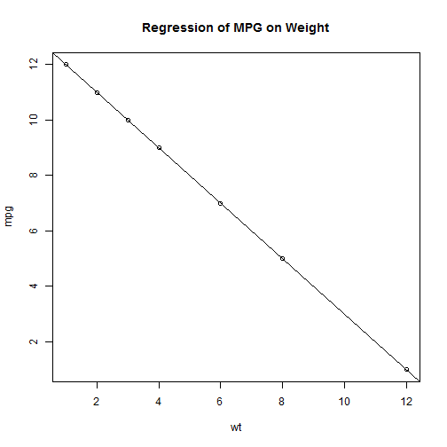

#### 第三章 图形初阶

##### 3.1使用图形
> R是一个惊艳的图形构建平台。在交互式会话中，可以通过逐条输入语句构建图形，并逐渐完善图形特征。

###### 示例


```r
wt <- c(1, 2, 3, 4, 6, 8, 12)  #汽车重量
mpg <- c(12, 11, 10, 9, 7, 5, 1)  #每加仑行驶英里数
mycars <- data.frame(wt, mpg)
attach(mycars)
```

```
## The following object(s) are masked _by_ '.GlobalEnv':
## 
##     mpg, wt
```

```r
plot(wt, mpg)
abline(lm(mpg ~ wt))
title("Regression of MPG on Weight")
```

 

```r
detach(mycars)
```

