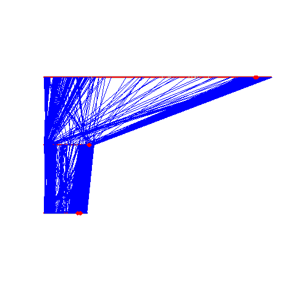

```r
# 读入数据
data1 = read.table("capana_with_pos.txt", header = TRUE)
add = max(data1$position)
add
```

```
## [1] 3.01e+08
```

```r
data1$position = 0 - data1$position + add
data2 = read.table("tomaoto_with_pos.txt", header = TRUE)
chr08 = read.table("soly_gene_with_position.txt", header = TRUE)
# chr08$position=4.5*chr08$position data2$position=4.5*data2$position
big_point = read.table("big_point_with_position.txt", header = TRUE)
```


# 画染色体

```r
# 比较三个片段的长度
length_chr = max(chr08$position)
length_data1 = max(data1$position)
length_data2 = max(data2$position)

# 我们看到上面data1的染色体最长，我们以最长的染色体来画图
plot(0, 0, xlim = c(0, length_data1), ylim = c(0, 60), type = "n", axes = FALSE, 
    xlab = "", ylab = "")

# 画染色体
segments(0, 50, length_data1, 50, lwd = 4, col = "grey", lend = 1)
segments(0, 30, length_chr, 30, lwd = 4, col = "grey", lend = 1)
segments(0, 10, length_data2, 10, lwd = 4, col = "grey", lend = 1)

# 标注基因
height1 = rep(50, length(data1$position))
points(data1$position, height1, pch = 1, cex = 0.1, col = "red")
height2 = rep(30, length(chr08$position))
points(chr08$position, height2, pch = 1, cex = 0.1, col = "red")
height3 = rep(10, length(data2$position))
points(data2$position, height3, pch = 1, cex = 0.1, col = "red")

mycolour = rainbow(5)
#
# points(big_point$position,big_point$height,pch=18,col=mycolour,cex=2.,adj=TRUE)

#
# arrows(big_point$position-3000000*sin(3.14*2*big_point$angle/180),big_point$height-9*cos(3.14*2*big_point$angle/180),big_point$position,big_point$height,pch=2,col=mycolour,)

# 画连线
data1$second = as.character(data1$second)
data2$second = as.character(data2$second)
chr08$gene = as.character(chr08$gene)
for (i in 1:dim(data1)[1]) {
    for (j in 1:dim(chr08)[1]) {
        if (isTRUE(data1$second[i] == chr08$gene[j])) {
            segments(data1$position[i], 50, chr08$position[j], 30, col = "blue", 
                lwd = 0.1)
        }
    }
}
# 第二条
for (i in 1:dim(data2)[1]) {
    for (j in 1:dim(chr08)[1]) {
        if (isTRUE(data2$second[i] == chr08$gene[j])) {
            segments(data2$position[i], 10, chr08$position[j], 30, col = "blue", 
                lwd = 0.1)
        }
    }
}

#
# arrows(big_point$position-3000000*sin(3.14*2*big_point$angle/180),big_point$height-9*cos(3.14*2*big_point$angle/180),big_point$position,big_point$height,pch=2,col='black')
points(big_point$position, big_point$height, pch = 18, col = "red", cex = 1.5, 
    adj = TRUE)
```

 

```r
`?`(segments)
```

```
## starting httpd help server ... done
```

